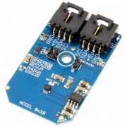

# BMA250

Bosch Sensortec’s BME250 is a triaxial, low-g acceleration sensor with digital output for consumer applications. It allows measurements of acceleration in three perpendicular axes. An evaluation circuitry (ASIC) converts the output of a micro-mechanical acceleration-sensing structure (MEMS) that works according to the differential capacitance principle. The Mini Module form factor delivered by NCD is ideal for rapid prototyping and hobbyist applications, employing a simple I2C connector to make this device more accessible on all computing platforms.

The Mini Module pictured above can be found [here](https://store.ncd.io/product/bma250-digital-triaxial-%C2%B12g-to-%C2%B116g-acceleration-sensor-with-intelligent-on-chip-motion-triggered-interrupt-controller-i2c-mini-module/)

You can find additional information about this repository in the programming language folders.
